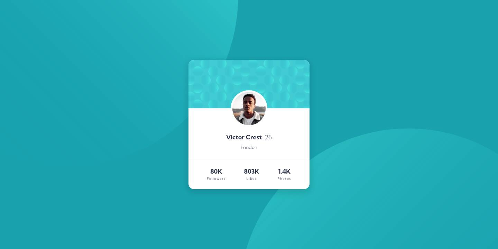

# Frontend Mentor - Profile card component solution

This is a solution to the [Profile card component challenge on Frontend Mentor](https://www.frontendmentor.io/challenges/profile-card-component-cfArpWshJ). Frontend Mentor challenges help you improve your coding skills by building realistic projects.

## Table of contents

- [Overview](#overview)
  - [The challenge](#the-challenge)
  - [Screenshot](#screenshot)
  - [Links](#links)
  - [Built with](#built-with)
  - [What I learned](#what-i-learned)
- [Author](#author)

## Overview

### The challenge

- Build out the project to the designs provided

### Screenshot

|Mobile|Desktop|
|---|---|
|||

### Links

- Solution URL: [Add solution URL here](https://github.com/chegx/profile-card-component)
- Live Site URL: [Add live site URL here](https://chegx.github.io/profile-card-component/)

### Built with

- Semantic HTML5 markup
- CSS custom properties
- Flexbox

### What I learned

Setting background image positions with the calc() function

```css
background-position: left calc(50% - 520px) top calc(50% - 370px), left calc(50% + 460px) top calc(50% + 500px);
}
```

## Author

- Frontend Mentor - [@chegx](https://www.frontendmentor.io/profile/chegx)
